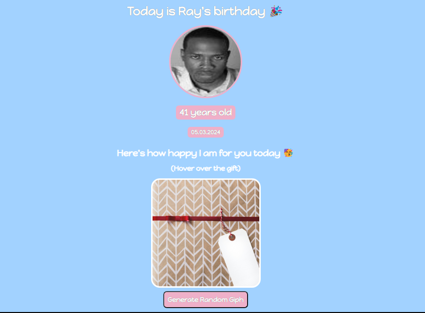

# Birthday GIFt Site

---

## Live Demo

[Click here to view the live demo](https://scrimba-horatio-birthday-gift-site.netlify.app/)

## Screenshot



## Features

---

## Technologies Used

---
# 🎉 Birthday GIFt Site 🎉

This is a fun, interactive birthday site that generates random birthday GIFs when you hover over the gift box or press a button! It displays the birthday person's name, age, and date, with a cool hover effect to reveal the GIF surprise.

## Live Demo

Check out the live demo [here](https://scrimba-horatio-birthday-gift-site.netlify.app/).

## Screenshots


## Features

- **Birthday Header**: Displays the birthday person's name, age, and birth date.
- **Hoverable Gift Box**: A fun interactive element that reveals a birthday GIF when hovered over.
- **Random GIF Generator**: A button to generate random birthday-themed GIFs.
- **Custom Styling**: Beautiful custom fonts, colors, and responsive design.
  
## Technologies Used

- **HTML5**: For structuring the webpage.
- **CSS3**: For styling, hover effects, and layout.
- **JavaScript**: For interactive GIF generation.
- **Giphy API**: To fetch and display birthday GIFs dynamically.


## Design Elements

- **Font**: Using the playful **Happy Monkey** font from Google Fonts.
- **Colors**: Soft, pastel colors that give the site a celebratory and friendly feel.
- **Hover Effects**: Adds an interactive feel to the gift box that reveals a hidden GIF upon hover.

## Getting Started

### 1. Clone the Repository
```bash
git clone https://github.com/your-username/birthday-gift-site.git
cd birthday-gift-site
